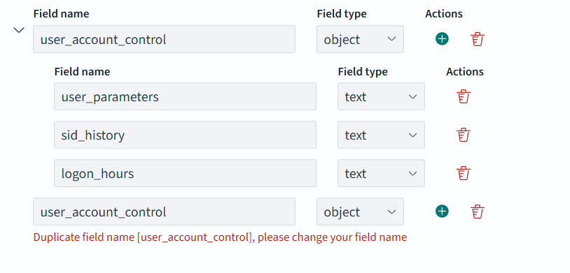

### User Account Creation (T1136)
The concept is that once attacker creates a new user account, he can use that account to masquard his activities. Creating multiple accounts help the attacker to use alternative accounts to perform differnt activities. Also upon deletion of some accounts, he can use the other newly created accounts to maintain his control over the target.

#### Local Account Creation (T1136.001)
```
net user username password /ADD 

New-LocalUser -Name USERNAME -Password (ConvertTo-SecureString -AsPlainText PASSWORD -Force)
```
#### Domain Account Creation  (T1136.002)
Using cmd
``` 
net user /add /domain USERNAME PASSWORD 
```
*Keep the  `/domain` argument as it is, not need to provide the actual domain name, since we are executing this on AD or from AD joined device, this flag will try to create this user as domain user.  

Using Powershell module `Import-Module ActiveDirectory `
```
New-ADUser -Name USERNAME -GivenName FIRSTNAME -Surname LASTNAME -SamAccountName SAMACCOUNTNAME -
UserPrincipalName USERPRINCIPALNAME -AccountPassword (ConvertTo-SecureString -AsPlainText PASSWORD -Force) 
PasswordNotRequired $true
```
#### Cloud Account Creation  (T1136.003)
We should watch for new account creations on the cloud platforms also..

Note: The above concept can be applied to all the devices, including Network, Linux and other IT/OT systems or All the devices/service which supports RBAC, authentications flows should be covered under this tactic `[T1136]`. 

TODO: Issue Observed, In normal windows log reader we are just getting the full event verbros in the descripton field, it seems not parsed correcly. 

Resoulution: used `parse_description true` to use the special parser, hence we aready written cutom regex for sysmon based events, we need to exclude sysmon channel from this input. create a new tag and make sure this tag is not parsed by sysmon regex patterns. If required send the events to opensearch using separate output. And Finally, don't forgot to refersh the mapping. 
```
<source>
  @type windows_eventlog2
  channels ["Security","System","Application"]
  read_existing_events false
  tag winevt.raw1
  parse_description true
  # rate_limit 200
  <storage>
    @type local
    persistent true
    path C:\opt\fluent\winlog1.json
  </storage>
</source>
```

TODO: Issue some events are rejected by opensearch while injecting them. 
```
2025-09-23 13:47:11 +0000 [warn]: #0 dump an error event: error_class=Fluent::Plugin::OpenSearchErrorHandler::OpenSearchError error="400 - Rejected by OpenSearch [error type]: illegal_argument_exception [reason]: 'can't merge a non object mapping [user_account_control] with an object mapping'" location=nil tag="events.security.windows" time=2025-09-23 13:46:27.711705300 +0000 record={"ProviderName"=>"Microsoft-Windows-Security-Auditing", "ProviderGUID"=>"", "EventID"=>"4738", "Level"=>"0", "Task"=>"13824", "Opcode"=>"0", "Keywords"=>"0x8020000000000000", "TimeCreated"=>"2025/09/23 13:46:24.942406300", "EventRecordID"=>"68771", "ActivityID"=>"", "RelatedActivityID"=>"", "ProcessID"=>"832", "ThreadID"=>"4400", "Channel"=>"Security", "Computer"=>"WinSvr2025AD.defender.local", "UserID"=>"", "User"=>"", "Version"=>"0", "DescriptionTitle"=>"A user account was changed.", "subject.security_id"=>"S-1-5-21-4293067992-2534530314-1424246907-500", "subject.account_name"=>"Administrator", "subject.account_domain"=>"DEFENDER", "subject.logon_id"=>"0x10BD44", "target_account.security_id"=>"S-1-5-21-4293067992-2534530314-1424246907-1119", "target_account.account_name"=>"persistance-19", "target_account.account_domain"=>"DEFENDER", "changed_attributes.sam_account_name"=>"-", "changed_attributes.display_name"=>"<value not set>", "changed_attributes.user_principal_name"=>"-", "changed_attributes.home_directory"=>"-", "changed_attributes.home_drive"=>"-", "changed_attributes.script_path"=>"-", "changed_attributes.profile_path"=>"-", "changed_attributes.user_workstations"=>"-", "changed_attributes.password_last_set"=>"9/23/2025 7:16:24 PM", "changed_attributes.account_expires"=>"<never>", "changed_attributes.primary_group_id"=>"-", "changed_attributes.allowedtodelegateto"=>"-", "changed_attributes.old_uac_value"=>"0x15", "changed_attributes.new_uac_value"=>"0x10", "user_account_control"=>["Account Enabled", "'Password Not Required' - Disabled"], "user_account_control.user_parameters"=>"-", "user_account_control.sid_history"=>"-", "user_account_control.logon_hours"=>"-", "additional_information.privileges"=>"-"}
```

The reason beeing, in the above record we have `user_account_control, user_account_control.logon_hours, user_account_control.sid_history, user_account_control.user_parameters` fields but we can have only one field object, but can have multiple sub object, and we can
t store values in the field object. Hence it's getting failed.



Resoulution: rename some fields 
```
<filter events.security.windows>
@type record_transformer
  <record>
    user_account_control_properties user_account_control
  </record>
  remove_keys user_account_control
</filter>
```


Issue: How to do we differnticate a local account create and domain account create events? If we don't know the domain name used by the org.
* use either domain sid or domain name 
* computer name and domain name is not equal (lazzy)

