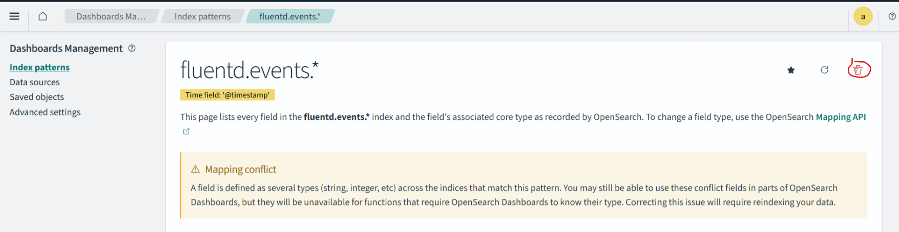
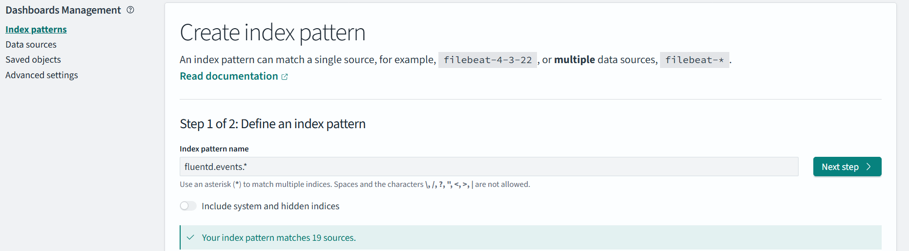
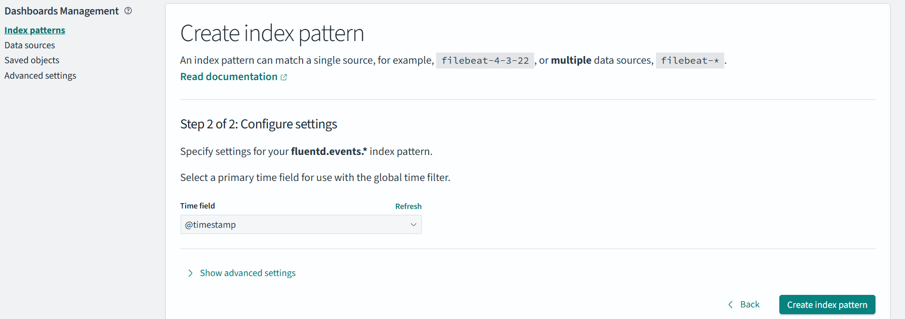
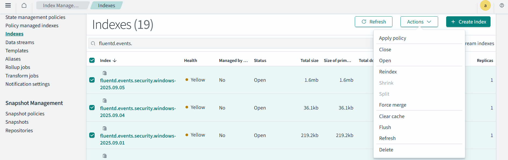

## Field Mapping issue:

In the opensearch-dashboard, when trying to filter the field, It'll show Mapping is not available to this field. In this we need to re-map them, let's see how we can do that. 

Why this issue is happening? As we dynmaically integrate more and more log sources, each logs might have different fields, but we haven't refershed mapping. this causes issue when we try to filter something which is not mapped.  

1. Goto Dashboard management -> Index Patterns -> Delete the pattern associated with fluentd.events.*
    

2. Create a new index pattern by selecting all the relevant indexes, and make sure now all the field types are selected correctly.

    
    
    

3. Goto Index Management -> Indexes -> Select all the indexes we need to work on. 
    select all the relevant indexes, Action -> Clear Cache. 

    

4. Now if we reload the patterns and refresh the logs, we should be able to use the field for analytics.

See you in the next exploration !!!