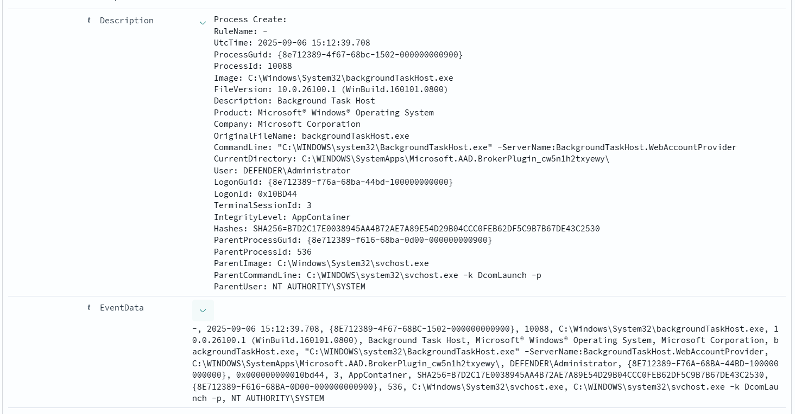

Issue 1: Not all data from the sysmon is mapped to the file, instead they are present in the `Description` or `EventData`
    After fixing the Issue 2, We need to do the re-mapping of fields, in the opensearch-dashboard.



Issue 2: we have multiple sysmon events, we need to carefully extract them, as `Description` for each sysmon event id is differnce, hence we need to create a regex differently.
    For this we can create a small python script to generate new patterns based on given log. 

Example if the log for process creation event is as below

```
    log_= """Process Create:\r\nRuleName: -\r\nUtcTime: 2025-09-06 15:19:52.355\r\nProcessGuid: {b2a55edd-5118-68bc-bd17-000000000800}\r\nProcessId: 2112\r\nImage: C:\\Windows\\System32\\ctfmon.exe\r\nFileVersion: 10.0.26100.3624 (WinBuild.160101.0800)\r\nDescription: CTF Loader\r\nProduct: Microsoft® Windows® Operating System\r\nCompany: Microsoft Corporation\r\nOriginalFileName: CTFMON.EXE\r\nCommandLine: /QuitInfo:0000000000000250;000000000000024C; \r\nCurrentDirectory: C:\\WINDOWS\\system32\\\r\nUser: DESKTOP-K05T3EJ\\Sec User\r\nLogonGuid: {b2a55edd-95cf-68b5-7004-cd0000000000}\r\nLogonId: 0xCD0470\r\nTerminalSessionId: 2\r\nIntegrityLevel: High\r\nHashes: MD5=A3E50EF69038B3415A4D75820255A301,SHA256=F219F0975E70935D0BD4898BC568B146603C1D2E07ECE027F5E5B5E4EAD203D5,IMPHASH=B539389D4BE1DD68C8213A539FEB41FB\r\nParentProcessGuid: {b2a55edd-a48c-68b1-3d00-000000000800}\r\nParentProcessId: 2844\r\nParentImage: C:\\Windows\\System32\\svchost.exe\r\nParentCommandLine: C:\\WINDOWS\\System32\\svchost.exe -k LocalSystemNetworkRestricted -p -s TextInputManagementService\r\nParentUser: NT AUTHORITY\\SYSTEM"""
```

And, Generated pattern using our small script is

```
Process Create:(?:\r?\n)(?:RuleName:\s+(?<RuleName>[^\r\n]+))(?:\r?\n)(?:UtcTime:\s+(?<UtcTime>[^\r\n]+))(?:\r?\n)(?:ProcessGuid:\s+(?<ProcessGuid>[^\r\n]+))(?:\r?\n)(?:ProcessId:\s+(?<ProcessId>[^\r\n]+))(?:\r?\n)(?:Image:\s+(?<Image>[^\r\n]+))(?:\r?\n)(?:FileVersion:\s+(?<FileVersion>[^\r\n]+))(?:\r?\n)(?:Description:\s+(?<Description>[^\r\n]+))(?:\r?\n)(?:Product:\s+(?<Product>[^\r\n]+))(?:\r?\n)(?:Company:\s+(?<Company>[^\r\n]+))(?:\r?\n)(?:OriginalFileName:\s+(?<OriginalFileName>[^\r\n]+))(?:\r?\n)(?:CommandLine:\s+(?<CommandLine>[^\r\n]+))(?:\r?\n)(?:CurrentDirectory:\s+(?<CurrentDirectory>[^\r\n]+))(?:\r?\n)(?:User:\s+(?<User>[^\r\n]+))(?:\r?\n)(?:LogonGuid:\s+(?<LogonGuid>[^\r\n]+))(?:\r?\n)(?:LogonId:\s+(?<LogonId>[^\r\n]+))(?:\r?\n)(?:TerminalSessionId:\s+(?<TerminalSessionId>[^\r\n]+))(?:\r?\n)(?:IntegrityLevel:\s+(?<IntegrityLevel>[^\r\n]+))(?:\r?\n)(?:Hashes:\s+(?<Hashes>[^\r\n]+))(?:\r?\n)(?:ParentProcessGuid:\s+(?<ParentProcessGuid>[^\r\n]+))(?:\r?\n)(?:ParentProcessId:\s+(?<ParentProcessId>[^\r\n]+))(?:\r?\n)(?:ParentImage:\s+(?<ParentImage>[^\r\n]+))(?:\r?\n)(?:ParentCommandLine:\s+(?<ParentCommandLine>[^\r\n]+))(?:\r?\n)(?:ParentUser:\s+(?<ParentUser>[^\r\n]+))
```

Then we can add the pattern in the fluentd.conf as below

You can also try the above pattern in the https://fluentular.herokuapp.com/ to check if the fields are correctly mapping are not.


```
<filter winevt.raw>
  @type parser
  key_name Description
  reserve_data true
  <parse>
    @type regexp
	expression /Process Create:(?:\r?\n)(?:RuleName:\s+(?<RuleName>[^\r\n]+))(?:\r?\n)(?:UtcTime:\s+(?<UtcTime>[^\r\n]+))(?:\r?\n)(?:ProcessGuid:\s+(?<ProcessGuid>[^\r\n]+))(?:\r?\n)(?:ProcessId:\s+(?<ProcessId>[^\r\n]+))(?:\r?\n)(?:Image:\s+(?<Image>[^\r\n]+))(?:\r?\n)(?:FileVersion:\s+(?<FileVersion>[^\r\n]+))(?:\r?\n)(?:Description:\s+(?<Description>[^\r\n]+))(?:\r?\n)(?:Product:\s+(?<Product>[^\r\n]+))(?:\r?\n)(?:Company:\s+(?<Company>[^\r\n]+))(?:\r?\n)(?:OriginalFileName:\s+(?<OriginalFileName>[^\r\n]+))(?:\r?\n)(?:CommandLine:\s+(?<CommandLine>[^\r\n]+))(?:\r?\n)(?:CurrentDirectory:\s+(?<CurrentDirectory>[^\r\n]+))(?:\r?\n)(?:User:\s+(?<User>[^\r\n]+))(?:\r?\n)(?:LogonGuid:\s+(?<LogonGuid>[^\r\n]+))(?:\r?\n)(?:LogonId:\s+(?<LogonId>[^\r\n]+))(?:\r?\n)(?:TerminalSessionId:\s+(?<TerminalSessionId>[^\r\n]+))(?:\r?\n)(?:IntegrityLevel:\s+(?<IntegrityLevel>[^\r\n]+))(?:\r?\n)(?:Hashes:\s+(?<Hashes>[^\r\n]+))(?:\r?\n)(?:ParentProcessGuid:\s+(?<ParentProcessGuid>[^\r\n]+))(?:\r?\n)(?:ParentProcessId:\s+(?<ParentProcessId>[^\r\n]+))(?:\r?\n)(?:ParentImage:\s+(?<ParentImage>[^\r\n]+))(?:\r?\n)(?:ParentCommandLine:\s+(?<ParentCommandLine>[^\r\n]+))(?:\r?\n)(?:ParentUser:\s+(?<ParentUser>[^\r\n]+))/
  </parse>
</filter>
```

The beauty of the above fluentd configuration is the if the logs matches the above regex, they will add the extracted fields, if not they won't add any field, and keep the original data, as we have added `reserve_data true`


For example, below is not relvant to the above pattern, hence the we don't add any new fields. 

```
2025-09-06 10:00:59.400054300 -0700 winevt.raw: {"ProviderName":"Microsoft-Windows-Sysmon","ProviderGUID":"","EventID":"8","Level":"4","Task":"8","Opcode":"0","Keywords":"0x8000000000000000","TimeCreated":"2025/09/06 17:00:56.953414400","EventRecordID":"19903","ActivityID":"","RelatedActivityID":"","ProcessID":"3544","ThreadID":"4200","Channel":"Microsoft-Windows-Sysmon/Operational","Computer":"DESKTOP-K05T3EJ","UserID":"S-1-5-18","User":"NT AUTHORITY\\SYSTEM","Version":"2","Description":"CreateRemoteThread detected:\r\nRuleName: -\r\nUtcTime: 2025-09-06 17:00:56.929\r\nSourceProcessGuid: {b2a55edd-95cb-68b5-6107-000000000800}\r\nSourceProcessId: 5156\r\nSourceImage: C:\\Windows\\System32\\dwm.exe\r\nTargetProcessGuid: {b2a55edd-95cb-68b5-5e07-000000000800}\r\nTargetProcessId: 2132\r\nTargetImage: C:\\Windows\\System32\\csrss.exe\r\nNewThreadId: 3848\r\nStartAddress: 0xFFFFF80059D97EC0\r\nStartModule: -\r\nStartFunction: -\r\nSourceUser: Window Manager\\DWM-2\r\nTargetUser: NT AUTHORITY\\SYSTEM","EventData":["-","2025-09-06 17:00:56.929","{B2A55EDD-95CB-68B5-6107-000000000800}","5156","C:\\Windows\\System32\\dwm.exe","{B2A55EDD-95CB-68B5-5E07-000000000800}","2132","C:\\Windows\\System32\\csrss.exe","3848","0xFFFFF80059D97EC0","-","-","Window Manager\\DWM-2","NT AUTHORITY\\SYSTEM"]}
```

But for the below, we are added few extraced fields. 

```
2025-09-06 10:02:13.390862300 -0700 winevt.raw: {"ProviderName":"Microsoft-Windows-Sysmon","ProviderGUID":"","EventID":"1","Level":"4","Task":"1","Opcode":"0","Keywords":"0x8000000000000000","TimeCreated":"2025/09/06 17:07:21.524316500","EventRecordID":"19921","ActivityID":"","RelatedActivityID":"","ProcessID":"3544","ThreadID":"4200","Channel":"Microsoft-Windows-Sysmon/Operational","Computer":"DESKTOP-K05T3EJ","UserID":"S-1-5-18","User":"DESKTOP-K05T3EJ\\Sec User","Version":"5","Description":"Ruby interpreter (CUI) 3.2.6p234 [x64-mingw-ucrt]","EventData":["-","2025-09-06 17:07:21.522","{B2A55EDD-6A49-68BC-AC18-000000000800}","3676","C:\\opt\\fluent\\bin\\ruby.exe","3.2.6p234","Ruby interpreter (CUI) 3.2.6p234 [x64-mingw-ucrt]","Ruby interpreter 3.2.6p234 [x64-mingw-ucrt]","http://www.ruby-lang.org/","ruby.exe","C:\\opt\\fluent\\bin\\ruby.exe -Eascii-8bit:ascii-8bit C:/opt/fluent/bin/fluentd -c C:\\opt\\fluent\\etc\\fluent\\fluentd.conf --under-supervisor","C:\\Users\\Sec User\\","DESKTOP-K05T3EJ\\Sec User","{B2A55EDD-95CF-68B5-3004-CD0000000000}","0x0000000000cd0430","2","High","MD5=E5608A47C9ECD83E8BCFC107EA6389B4,SHA256=8F095D6C8039CC3242A39BE1080665824198BF68DA05F923CDAD97004FF86396,IMPHASH=01DC7955A53767B850E59DE33ECA0850","{B2A55EDD-6A47-68BC-AA18-000000000800}","1944","C:\\opt\\fluent\\bin\\ruby.exe","\"C:\\opt\\fluent\\bin\\ruby.exe\"  \"C:\\opt\\fluent\\bin\\fluentd\" -c C:\\opt\\fluent\\etc\\fluent\\fluentd.conf","DESKTOP-K05T3EJ\\Sec User"],"RuleName":"-","UtcTime":"2025-09-06 17:07:21.522","ProcessGuid":"{b2a55edd-6a49-68bc-ac18-000000000800}","ProcessId":"3676","Image":"C:\\opt\\fluent\\bin\\ruby.exe","FileVersion":"3.2.6p234","Product":"Ruby interpreter 3.2.6p234 [x64-mingw-ucrt]","Company":"http://www.ruby-lang.org/","OriginalFileName":"ruby.exe","CommandLine":"C:\\opt\\fluent\\bin\\ruby.exe -Eascii-8bit:ascii-8bit C:/opt/fluent/bin/fluentd -c C:\\opt\\fluent\\etc\\fluent\\fluentd.conf --under-supervisor","CurrentDirectory":"C:\\Users\\Sec User\\","LogonGuid":"{b2a55edd-95cf-68b5-3004-cd0000000000}","LogonId":"0xCD0430","TerminalSessionId":"2","IntegrityLevel":"High","Hashes":"MD5=E5608A47C9ECD83E8BCFC107EA6389B4,SHA256=8F095D6C8039CC3242A39BE1080665824198BF68DA05F923CDAD97004FF86396,IMPHASH=01DC7955A53767B850E59DE33ECA0850","ParentProcessGuid":"{b2a55edd-6a47-68bc-aa18-000000000800}","ParentProcessId":"1944","ParentImage":"C:\\opt\\fluent\\bin\\ruby.exe","ParentCommandLine":"\"C:\\opt\\fluent\\bin\\ruby.exe\"  \"C:\\opt\\fluent\\bin\\fluentd\" -c C:\\opt\\fluent\\etc\\fluent\\fluentd.conf","ParentUser":"DESKTOP-K05T3EJ\\Sec User"}
```

As you can see some new fields are added, such as ParentUser, CommandLine, etc.

Similarly we need to added multiple patterns to capture other fields present in the sysmon events. without loosing 

TODO: Add patterns for each of the sysmon event types using examples. Can you do it everything at a same time, collect all log type formats, create pattern, and create fluentd config defnitions.