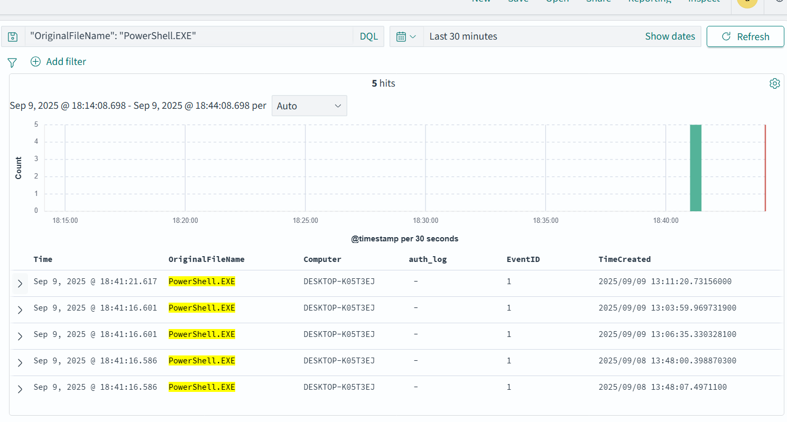
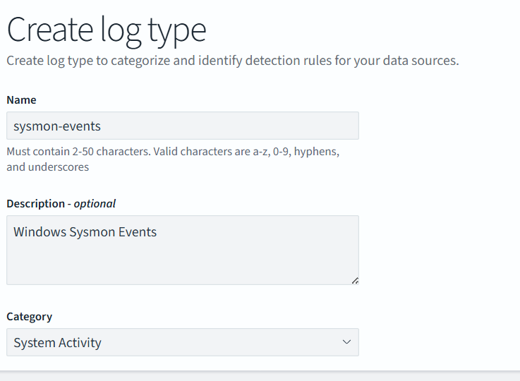
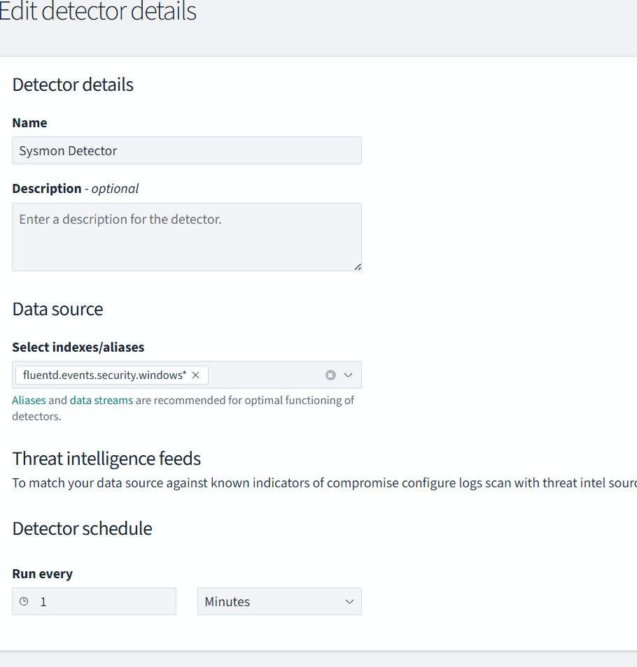
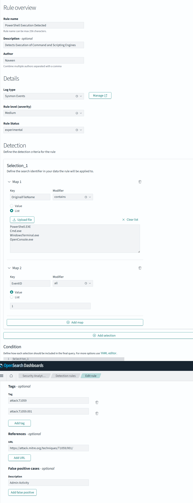
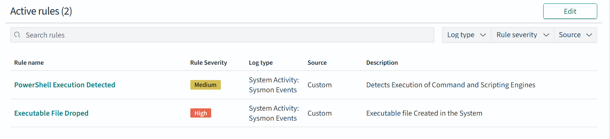
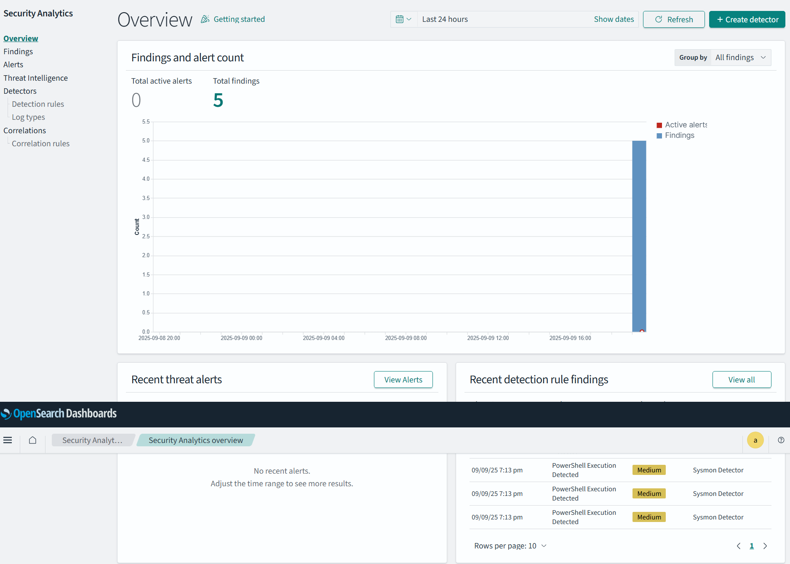

Let's Create few basic detection rule. 

.exe files droped
Power Shell/Cmd - Execution

* First we need to identify the events we want to flag/log as a Alerts.

* Create a Log Type

* Create a Detector

* Then create a Rule

Each time we create a new rule, we need to enable them manually, and if we have need for mapping fields we need to resolve the conflict. 

* Execute the commands to generate the logs and wait for few minutes to generate the alerts. 

