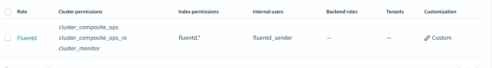

Note: I have already installed the opensearch and opensearch-dashboards in the ubuntu server. I will use that setup for forwarding logs.

**Goals we are aiming for:** 

    Goal 1 - it should use some auth to send logs, but the admin creds.

    Goal 2 - It should store the logs in the separate index for each of the log type, for now that's all

**Send Logs to OpenSearch**
1) Add the below match definitions in the fluentd.conf file. 
```
  <match core_server_*>
    @type opensearch
    host "coreserver"
    port 9200
    user log_sender
    password xxxxxx
    logstash_format true
    logstash_prefix "fluentd.${tag}"
  </match>
```
2) start the command `watch -n 3 "curl http://testmynids.org/uid/index.html"` which will start firing suricata events. 

3) To check if we are able to receive the logs from fluentd, 

    open `http://coreserver:5601/app/opensearch_index_management_dashboards#/indices` and search for `fluent`

    Now we should be able to see the new index. (Sometimes it might take one or two minutes)

    Alternatively we can also check if the opensearch is received the log and it is mapping the index correctly using `sudo cat /var/log/opensearch/opensearch.log | grep MetadataMappingService`

**Now, let's try to use a account with LEAST PRIVILEGE to send logs.** 

Go to `Internal users` section located at `http://coreserver:5601/app/security-dashboards-plugin#/users` and create a user named 'fluentd_sender' and with very very good password.



and Go to Roles `http://coreserver:5601/app/security-dashboards-plugin#/roles`

and create a custom role with below permissions
1) Role Name "fluentd"
2) Cluster Permission "cluster_composite_ops", "cluster_composite_ops_ro", "cluster_monitor"
3) Index "fluentd.*"
4) Index Permission "crud", "create_index"

Once role is created it should look like this


and In the `fluentd.conf` we'll make little chage to make sure if our account is working or not. 

```
  <match core_server_*>
    @type opensearch
    host "coreserver"
    port 9200
    user "fluentd_sender"
    password xxxxxx
    logstash_format true
    logstash_prefix "fluentd.1${tag}"
  </match>
```
Note: now we are going to write the event's into the `fluentd.1${tag}`, `.1`  instead of the previous index.


The `opensearch.log` will throw this info when the account is successfully able to write data into the given index.

`[2025-08-28T13:34:08,226][INFO ][o.o.c.m.MetadataMappingService] [coreserver] [fluentd.1core_server_suricata-2025.08.28/EZUB5k0mSuWe8t-1g7aU_w] update_mapping [_doc]`

We aer good to start event monitoring!! 


